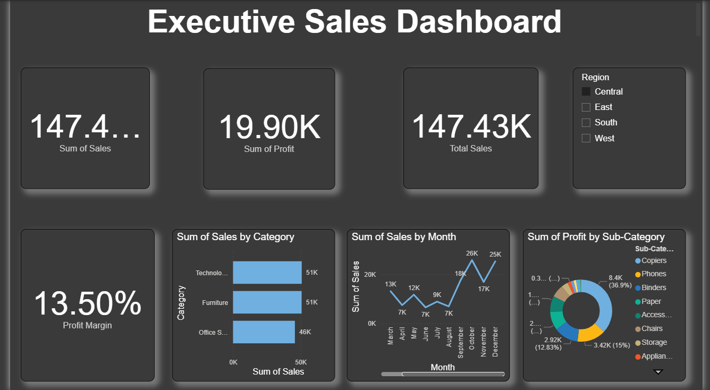

# Superstore Sales Analysis Dashboard (Power BI)

## Project Overview
This Power BI dashboard provides a comprehensive analysis of sales data for a retail "Superstore." The goal of this project is to visualize key performance indicators (KPIs) such as total sales, profit, and quantity sold across different regions, categories, and time periods.

## Key Features
* **Sales Performance:** Track total sales and profit trends over time.
* **Category Analysis:** Identify which product categories (Technology, Furniture, Office Supplies) are performing best.
* **Regional Insights:** Visualize sales distribution across different states and regions.
* **Customer Segmentation:** Analysis of sales based on customer segments (Consumer, Corporate, Home Office).

## Files in this Repository
* `basic poweri bi dashboard.pbix`: The main Power BI project file.
* `Sample - Superstore.csv`: The raw dataset used for this analysis.
* `Dashboard_Preview.pdf`: A PDF export of the dashboard for quick viewing.

## Dashboard Preview
 

## How to View
1. Download the `.pbix` file.
2. Open it using **Power BI Desktop**.
3. If the data doesn't load, make sure to update the data source settings to point to the `Sample - Superstore.csv` file in your local folder.

## Tools Used
* Power BI Desktop
* Power Query (for Data Cleaning)
* DAX (for Calculated Measures)
